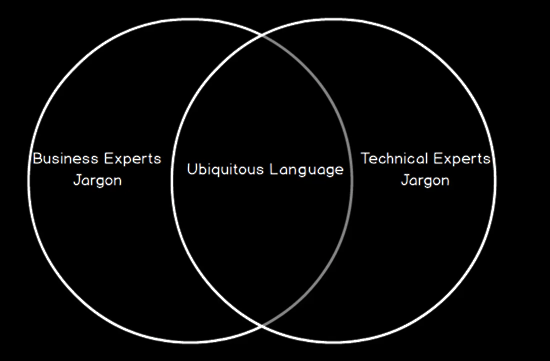
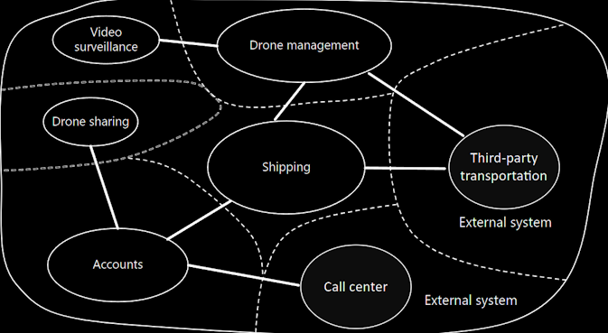
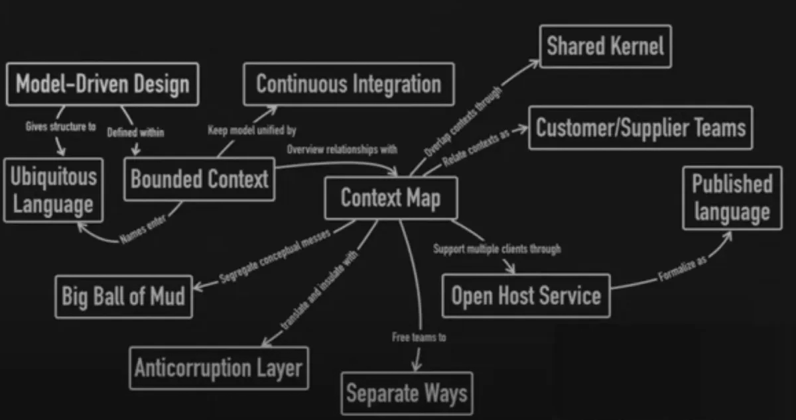
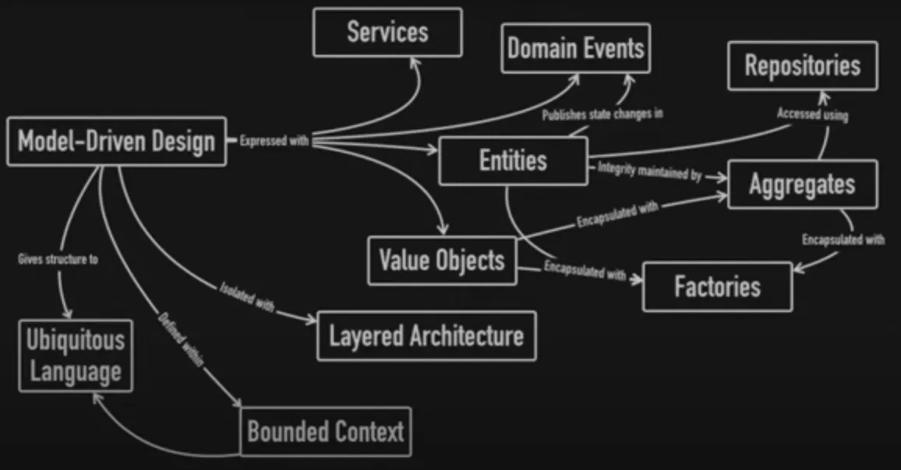
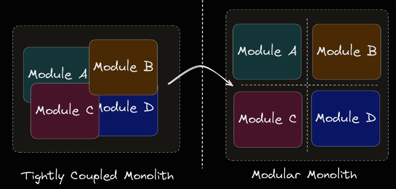
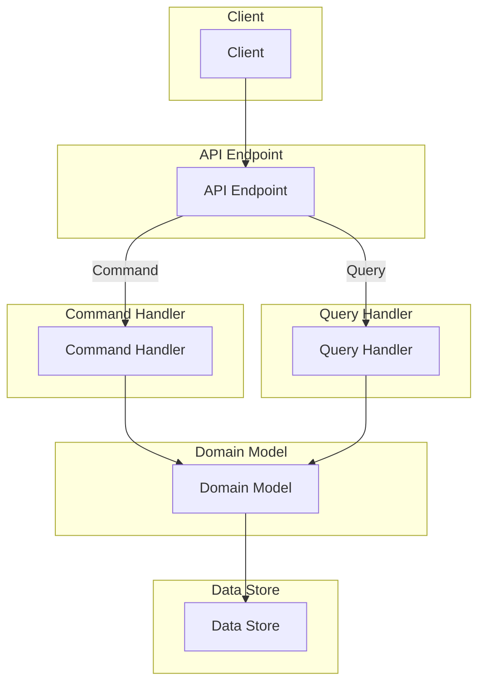

=====================================

# Architecture overview

> An application built using .NET 8 and following a Domain-Driven Design approach, that is structurally divided into modular components, but still operates as a single monolithic application.

[TOC]

## Introduction

Software architecture is the concept that describes how a software system is organized and designed. It defines the structure, behavior, communication and relationship of the software components. It provides a high-level view of the software system, helping software developers to design and manage complex software systems. Software architecture involves making decisions about the software's organization, including how it will be divided into layers, how the layers will interact with each other, and how the system will be deployed.

> Software architecture is important because it affects the quality, performance, maintainability and scalability of a software system.

Some of the main concepts in software architecture are:

- **Structure**: How a software system is organized into components or modules that have defined responsibilities and interfaces.
- **Behavior**: How a software system responds to events or requests that trigger its functionality.
- **Communication**: How a software system exchanges data or messages among its components or with external systems.
- **Stakeholders**: The people or groups who have an interest or influence on a software system, such as users, developers, managers, customers.
- **Quality attributes**: The non-functional requirements that affect a software system’s performance, reliability, security, usability.
- **Architecture styles**: The common patterns or principles that guide a software system’s design, such as monolithic, microservices, layered, event-driven.

## Concepts

### Layers & Dependencies

In software architecture, a layered approach is used to organize the different components of a system into separate and distinct layers. These layers are designed to perform specific functions and work together to provide a complete application.

An approach to layering is to use four layers: Presentation, Application, Domain, and Infrastructure. Each layer has a specific purpose and is responsible for different aspects of the system.

The **Presentation layer** is responsible for presenting information to the user and handling user input. It typically includes the user interface and any presentation logic needed to format data for display.

The **Application layer** provides the business logic and processes user input from the presentation layer. This layer is responsible for implementing the application's use cases and orchestrating the work done in the other layers.

The **Domain layer** represents the core business logic of the system. It encapsulates the domain entities, value objects, and business rules that govern the behavior of the application.

Finally, the **Infrastructure layer** provides the technical foundations for the system. This includes things like data storage, communication protocols, and external systems.

```text
                                                .----------------.  - Services, Jobs, Validators, Models
                                                | Application    |  - Commands/Queries + Handlers
   - WebApi/Mvc/                            .-->|                |  - Messages/Queues + Handlers
     SPA/Console program host              /    `----------------`  - Adapter Interfaces, Exceptions
                                          /        |        ^
  .--------------.                       /         |        |
  |              |     .--------------. /          V        |  - Events, Aggregates, Services
  | Presentation |     |              |/        .--------.  |  - Entities, ValueObjects
  | .Web|Tool    |---->| Presentation |-------->| Domain |  |  - Repository interfaces
  |  Service|*   |     |              |\        `--------`  |  - Specifications, Rules
  |              |     `--------------` \          ^        |
  `--------------`                       \         |        |
                       - Composition Root \        |        |
                       - Controllers       \     .----------------.
                       - Endpoints          \    | Infrastructure |  - Interface implementations (Adapters/Repositories)
                       - Razor Pages         `-->|                |  - DbContext
                       - Hosted Services         `----------------`  - Data Entities + Mappings
                       - View Models + Mappings
                       - Module definition
```

#### Dependencies

An important principle to keep in mind when designing software architectures with layers is the [Dependency Inversion Principle (DIP)](#Dependency-Inversion-Principle-(DIP)). This principle states that high-level modules should not depend on low-level modules, but both should depend on abstractions. This means that the layers should be designed to depend on abstractions rather than concrete implementations, which allows for greater flexibility and easier maintenance.

Dependencies flow from the outer layers toward the innermost (Domain) layer. This means the inner (Domain) layer is entirely decoupled from the outside world and can be tested independently of the other components. The inner (Domain) layer is at the center of the architecture, and all other layers depend on it for their functionality.

```text
             .-------------------------------.
             |                  Presentation |
             |   .-----------------------.   |
             |   |           Application |   |
             |   |   .---------------.   |   |
             |   |   |               |   |   |
             |   |   |    Domain <<=======================
             |   |   |               |   |   |  Dependency
             |   |   `---------------`   |   |        flow
             |   |                       |   |
             |   `-----------------------`   |
             |                Infrastructure |
             `-------------------------------`
```

#### Coupling

Layering can help reduce coupling by defining clear boundaries between different parts of the system. Each layer has a specific responsibility and communicates only with the layers immediately above and below it. This can help reduce the number of dependencies between modules and make the system more loosely coupled.

#### Cohesion

Layering can help promote high cohesion by grouping related functionality together into separate layers. For example, the domain layer contains the core business logic of the system, which is closely related and works together to achieve the system's business objectives. By grouping this functionality together into a separate layer, the system can achieve high cohesion within that layer.

#### Summary

A layered approach to software architecture can help organize and separate the different components of a system. The four layers of presentation, application, domain, and infrastructure can work together to provide a complete application, and the Dependency Inversion Principle helps to ensure that the layers are designed to be flexible and maintainable. Layering can have a significant impact on the coupling and cohesion of a system. By defining clear boundaries between different parts of the system, layering can help reduce coupling and promote high cohesion within individual layers.

### Vertical Slice Architecture

> In a Vertical Slice Architecture the application is separated into vertical slices, meaning that a vertical slice represents
> the part of each layer that creates a specific feature/capability (grouped in modules). Vertical Slicing implies a Module cuts across all layers,
> which can include Presentation, Application, Domain and Infrastructure.

In a [Vertical Slice Architecture](https://jimmybogard.com/vertical-slice-architecture/), A Module manages its data access code, domain logic, configuration and its presentation code,
this way low coupling and have high cohesion between can be achieved. The aim is to reduce the coupling between Modules to only
concern themselves about a single vertical slice not N-layers, which improves maintainability.

The name of the Module should be derived directly from the Ubiquitous Language and should reflect an important concept from the feature/capability itself.
Any member of the team should be able to tell you what role and responsibilities any particular Module should possess, given it’s name.

A Module will typically contain one, or multiple Aggregate Roots that are highly cohesive. If there are multiple Aggregates in a Module, but one is not cohesive
with the others, it’s time to break it out into its own Module.

```text
                     .-------------.    .-------------.    .-------------.
                     |             |    |             |    |             |
  .------------------|             |----|             |----|             |-------.
  | Presentation |||||             ||||||             ||||||             |||||||||
  `------------------|             |----|             |----|             |-------`
                     |   Shopping  |    |   Identity  |    |    . . .    |
  .------------------|    Module   |----|    Module   |----|             |-------.
  | Application  |||||             ||||||             ||||||             |||||||||
  `------------------|             |----|             |----|             |-------`
                     |             |    |             |    |             |
  .------------------|             |----|             |----|             |-------.
  | Domain       |||||             ||||||             ||||||             |||||||||
  `------------------|             |----|             |----|             |-------`
                     |             |    |             |    |             |
  .------------------|             |----|             |----|             |-------.
  | Infrastructure |||             ||||||             ||||||             |||||||||
  `------------------|             |----|             |----|             |-------`
                     `-------------`    `-------------`    `-------------`
```

> "*A well-defined segmentation of the project effort ensures system modularity. Each task forms a separate, distinct program module. At implementation time each module*
> *and its inputs and outputs are well-defined, there is no confusion in the intended interface with other system Modules. At checkout time the integrity of the module is*
> *tested independently; there are few scheduling problems in synchronizing the completion of several tasks before checkout can begin. Finally, the system is maintained in*
> *modular fashion; system errors and deficiencies can be traced to specific system Modules, thus limiting the scope of detailed error searching.*" from [Decomposing Systems into Modules ](https://dl.acm.org/doi/pdf/10.1145/361598.361623)

#### Principles

- **Modularity**: Using Modules in a application or service will help organize code, keep related classes together and lead along the path towards low coupling.
- **Use-case Driven**: System are developed based on a slice and structured around Features and Capabilities. Splitting off features/capabilities for things like scaling out is much less difficult.
- **Melting Abstractions**: There are no gates or barriers across layers, everything needed for the feature/capability (or module) is included in the slice itself where possible.
- **Axis Of Change**: a core tenet of vertical slicing is the belief that things that change together should be near each other. Whenever a feature is added, removed, or changed the things that change should not be scattered across the entire system.

### Domain Driven Design

[Domain Driven Design](https://www.domainlanguage.com/wp-content/uploads/2016/05/DDD_Reference_2015-03.pdf) (DDD) is an approach to software development that focuses on the domain model, or the business logic and operations of the application. It is based on the concept of a “ubiquitous language”, which is a shared language between developers, business analysts, and users that allows for better communication and collaboration. DDD also emphasizes the importance of decomposing the application into distinct and independent modules, which are then organized into bounded contexts. These bounded contexts allow for better scalability and maintainability, as only the relevant portions of the application are changed when the application is updated or expanded.

The pillars of Domain Driven Design are:

1. **Ubiquitous Language**: A shared language between developers, business analysts, and users that allows for better communication and collaboration.
   
   ([source]([https://medium.com/@mazraara/the-building-blocks-of-domain-driven-design-ddd-af745a53a9eb]))
2. **Bounded Context**: The decomposition of the application into distinct and independent Modules, which are then organized into bounded contexts.
   
   ([source](https://learn.microsoft.com/en-us/azure/architecture/microservices/model/domain-analysis#define-bounded-contexts))
3. **Domain Model**: The business logic and operations of the application. Modelling is an iterative process that involves collaboration between developers, domain experts, and stakeholders to identify and refine the best-fit solution for a problem.
4. **Strategic Design**: Involves understanding the application’s domain and determining the best way to model and structure the application. This includes identifying bounded contexts, designing the domain model, and deciding on the best technology stack for the application. Additionally, Strategic Design also involves understanding the application’s use cases and user stories in order to ensure that the system meets the user’s needs. Some examples of patterns include Bounded Contexts, Context Maps, Ubiquitous Language, and Anti-Corruption Layers.
   
   ([source]([https://medium.com/@mazraara/the-building-blocks-of-domain-driven-design-ddd-af745a53a9eb]))
5. **Tactical Design**: Are used to help structure and guide the system design process. These patterns help to bring domain knowledge and domain logic into the system design. Some examples of patterns include Aggregates, Entities, Value Objects, Services, Commands, Events, and Repositories.
   
   ([source]([https://medium.com/@mazraara/the-building-blocks-of-domain-driven-design-ddd-af745a53a9eb]))

#### Steps
```text
               |                    |                       |
Analyze Domain | >>  Define bounded | >>   Define entities, | >> Identify
               |     context        |      aggregates and   |    Modules or
               |                    |      services         |    Services
```

1. Start by analyzing the business domain to understand the application's functional requirements. The output of this step is an informal description of the domain, which can be refined into a more formal set of domain models.
2. Next, define the Bounded Contexts of the Domain. Each Bounded Context contains a Domain Model that represents a particular subdomain of the larger application.
3. Within a Bounded Context, apply the Tactical Design patterns to define entities, aggregates, and domain services.
4. Use the results from the previous step to identify the Modules or Services in your application.

### Modular Monolith

> A modular monolith is a software design approach in which a system is designed with an emphasis on interchangeable (and potentially reusable) modules. This has system has exactly one deployment unit.

As the name Modular Monolith Architecture suggests, the design of the architecture must be oriented towards high [modularity](https://en.wikipedia.org/wiki/Modularity). This means that the system must have self-contained modules that provide all the business functionality. Therefore, domain-centric architecture and design is a natural choice in this case. If there is no need to distribute your system (most systems don't) and the system is non-trivial - a Modular Monolith with [Domain Centric Design](https://jlasoc.medium.com/what-is-domain-centric-architecture-e030e609c401) as the approach will be the right direction.

Both modular and non-modular [Monolithic applications](https://en.wikipedia.org/wiki/Monolithic_application), have one deployment unit. On deployment all modules within an application are deployed. Benefits:

1. **Increased Reusability**

  or large development teams, developing modular components of an application helps to increase reusability. Modular components can be reused and repurposed and can help teams establish a single source of truth. This can lead to faster and more consistent development.

2. **Better-Organized Dependencies**
Because modular monoliths make individual functions more independent, they, by nature, make dependencies more organized and visible. This makes it easier for developers to easily assess which parts of the application require which dependencies.


There are a few key differences between a standard monolith and a modular monolith:

| Monolith Benefits                                  | Modular Monolith Benefits                                 |
| -------------------------------------------------- | --------------------------------------------------------- |
| Low operational complexity.                        | Low operational complexity.                               |
| Can be more secure than microservices application. | Can be more secure than microservices application.        |
| Easy to manage database consistency.               | Easy to manage database consistency.                      |
| Less complex than microservices application.       | Less complex than microservices application.              |
|                                                    | Developed modules potentialy reusable                     |
|                                                    | Has better-organized dependencies than standard monolith. |
|                                                    | Better code observability than standard monolith.         |


[source](https://www.milanjovanovic.tech/blog/modular-monolith-communication-patterns)

> Best pragmatic choice, for most applications, combining the simplicity of monoliths with the structure and focus of microservices.

What are the difficulties faced when creating a Modular Monolith architecture?

The key challenges to consider are:

- Establishing the boundaries of each module
- Facilitating communication between modules
- Ensuring data isolation within modules

To speed up development, compromises can be made on these challenges, but it can result in increased coupling. High coupling means that changes in one module will have a ripple effect and cause changes in many other modules, making the system more difficult to maintain and modify.

#### Modularity

> Modular programming is a software design technique that emphasizes separating the functionality of a program into independent, interchangeable modules, such that each contains everything necessary to execute only one aspect of the desired functionality.

In order to have a modular architecture, modules are required and they:

1. **Must be independent and interchangeable**:
   For the module to meet these assumptions, as the name implies, it should be independent. It is impossible for it to be completely independent because then it means that it does not integrate with other modules. The module will always depend on something, but dependencies should be kept to a minimum. According to the principle: [Loose Coupling, Strong Cohesion](https://en.wikipedia.org/wiki/Coupling_%28computer_programming%29).
2. **Must have everything necessary to provide desired functionality**:
   The module in the Modular Monolith is a business module that is able to fully provide a set of desired features by using all the Layers. In this way, frequent changes affect only one module – it becomes more independent, autonomous and is able to provide functionality by itself. According to the principle: Vertical Slice Architecture (see above)
3. **Must have a defined interface**:
   A Contract is what is made available outside of the module. It is an “entry point” to the module. Good Contracts should be unambiguous and contain only what clients need (). It should be kept stable (to not break the clients), small and hide everything ([Encapsulation](https://en.wikipedia.org/wiki/Encapsulation_(computer_programming))). Contracts take different forms: public methods, APIs, published Messages or exposed Queues. Domain Events are not part of the contract. Everything that is shared to the outside becomes the public API of the module. Therefore, encapsulation is an important element of modularity.

By making the system modular it requires discipline in following the rules and principles of good design:

- Domain-centric at multiple levels
- Well-defined integration points (interfaces, API, gateways)
- Self-contained, encapsulated modules
- Testability: making the application and domain layer independent of frameworks and infrastructure
- Evolutionary: easy to develop maintain and reuse (add new modules or gateways)

#### Modules

Each Module should be treated as a separate application. In other words, they are a subsystem of our system. Thanks to this, it will have autonomy. It will be loosely or not at all coupled to other Modules. This means that each Module can be developed by a separate team. This is the same [architectural driver](https://www.informit.com/articles/article.aspx?p=2738304&seqNum=4) as in the case of a microservice architecture. In addition, it will be easier to extract a particular Module into a separate runtime component ([Monolith split](https://martinfowler.com/articles/break-monolith-into-microservices.html)). Only if necessary, this is not the goal of the architecture itself, just a great side effect of having modularity.

Since the Module should be domain-oriented (see [Bounded Context ](https://martinfowler.com/bliki/BoundedContext.html)concept from DDD), the domain-centric architecture can be used – on the level of the Module itself.

##### Boundaries

- Look for highly cohesive blocks of functionality
- Aim for low coupling to other Modules
- Expose a small , well defined and stable API
- Only expose Aggregate Roots through the API
- Make implementation and other entities private to the Module
- Only depend on API (not implementation) of other Modules

````txt
   .---------------.         .---------------.
   |    API        |- - - - >|     API       |
   |---------------| depends |---------------|
   | Module        |   on    | Module        |
   | Implmentation |         | Implmentation |
   `---------------`         `---------------`
````

##### Integration

The Modular Monolith architecture design assumes 2 forms of communication with other Modules:

1. **Asynchronous** (eventual):
   By using events ([Event-Driven architecture](https://en.wikipedia.org/wiki/Event-driven_architecture)). Each module sends or subscribes to certain Messages via the Message Broker. This broker can be an in memory mechanism or out-of-process component. Asynchronous calls typicaly don't provide a return value, they are more fire and forget style.

   ```` text
   [ModuleA > Message ] > Message Broker > [ModuleB > MessageHandler]
   ````

2. **Synchronous** (direct):
   By using direct calls. As in the case of API communication between modules where a result is expected, it can be implemented in a traditional approach or more CQS-style (Commands / Queries). What is important here is that such integration should be explicit – by creating an [Adapter or Gateway](https://martinfowler.com/eaaCatalog/gateway.html) on the consumer side and a [Facade](https://en.wikipedia.org/wiki/Facade_pattern) (Port) on the provider side.

   ````text
   [ModuleA > Adapter] > API > [ModuleB > Command/Query]
   ````

> Integration with other Modules or external systems is a good candidate to introduce an [Anti-Corruption Layer](#Anti-Corruption-Layer) to have better isolation.

##### Data Isolation

Each module must have its own state, which means that its data must be private to other Modules. A [Shared Database](https://www.enterpriseintegrationpatterns.com/patterns/messaging/SharedDataBaseIntegration.html) should not be used. This is a key attribute needed to achieve the autonomy and modularity of a Module. If it is needed to know the state of another Module or change state – it has to be done through the interface.

- Ensure each Module only accesses it's own tables
- No sharing of tables  between Modules
- Joins only between tables of same Module (not across Modules)

   ```txt
   .---------------.         .---------------.
   |    API        |         |     API       |
   |---------------|         |---------------|
   | Implmentation |         | Implmentation |
   |---------------|   \/    |---------------|
   |    Data       |- -/\- ->|     Data      |
   `---------------`   not   `---------------`
                     allowed
   ```

Isolation Types:

- **Separate Table**: same schema, same db, same RDBMS

- **Separate Schema**: different schema, same db, same RDBMS

- **Separate Database**: different schema, different db, same RDBMS

- **Other Persistence**: different schema, different db, different (R)DBMS

##### Reference Data

[Reference data](https://youtu.be/_9ULo-F4nmE?list=PL03Lrmd9CiGdOxMEQ6JS6GDT3BV8-_Xki&t=2437) in a Module is data that was obtained from another Module that owns and manages that kind of data. For example, a Module might use reference data from another Module to validate input or to have a way to lookup values without the need to have direct communications with that Module. Typically, this reduces the need for direct integration by using synchronous API calls to the other Module. This data is typically not part of the domain model, as it does not represent any business logic or operations. However, reference data can be used to provide additional context and insight into the domain model, such as providing a list of valid values for certain parameters.

Reasons why it can be helpful to store reference data from another Module:

- **Data validation**: Storing reference data in a Module allows it to validate input against the reference data, ensuring that the data is accurate and consistent across Modules.
- **Performance**: By storing reference data locally, you can reduce the number of API calls or database queries required to access the data, resulting in improved performance and reduced latency.
- **Business logic**: The reference data from another Module could be needed to implement certain business logic or features in a Module.

Many ways to obtain reference data are available, including:

1. **API calls**: One Module can make synchronous API calls to another Module to obtain the reference data.
2. **Database replication**: Another Module it's database can be replicated to a Module it's database.
3. **File transfer**: Reference data can be transferred between Modules in the form of files, such as CSV or JSON.
4. **Messaging**: Reference data from another Module can be obtained by receiving Messages containing the data. This approach is known as event-driven architecture and it allows Modules to receive data in real-time when it changes.

````text
          ModuleA                                  ModuleB
.----------------.                        .---------------.
|    API         |    .--------------.    |     API       |
|----------------|<--< Message Broker <<--|---------------|
|                |    `--------------.    |               |
|----------------|           published    |---------------|
|    Data        |               state    |     Data      |
|----------------|                        `---------------`
| Reference Data |
`----------------`
````

#### Summary

1. A Monolith is a system that has exactly one deployment unit.
2. Monolith architecture does not imply that the system is poorly designed, not modular or bad. It does not say anything about quality.
3. Modular Monolith architecture is an explicit name for a Monolith system designed in a modular way.
4. To achieve a high level of modularization each module must be independent, has everything necessary to provide desired functionality (separation by business modules), encapsulated and have a well-defined interface/contract.

### Anti-Corruption Layer

> In Domain-Driven Design, an Anti-Corruption Layer is a design pattern used to isolate a bounded context from the outside world,
> particularly when interacting with another bounded context or an external system that uses different domains, data models or business rules.

The Anti-Corruption Layer typically consists of a set of interfaces, adapters/gateways and translators that map the data and behaviors
of the external system into the terms and concepts of the Domain Model. The layer can also handle the transformation and validation
of messages, events, and commands exchanged between the contexts, and can implement the appropriate error handling and recovery mechanisms.

Integration with external systems imposes a risk on the new system since legacy models are usually poorly (non poco, dependencies) designed and thus the new, well designed domain model is very likely to be corrupted by the legacy integration. It also provides a strategy to replace the external system by something else or new, as all interaction is cleary defined in an interface without external system leackage into the new system.

- An Application Module (Catalog) uses an external system (PIM) for it's data needs:
```text
                                 .-----------------.
                                 |                 |
         .-------------.         |                 |               .-------------.
         |             |         |                 |               |             |
         |   Local     |         | Anti            |               |             |
         |   System    |         | Corruption      |               |  External   |
         |   (Catalog  |=======>>|  Layer          |=============>>|  System     |
         |    Module)  |         |                 |               |  (PIM)      |
         |-------------|         |                 |               |             |
         |   Domain    |         |                 |               |             |
         `---------^---`         |                 |               |-------------|
                    \            |-----------------|         .-----|  Database   |
                     `---------<-| Adapter/        |<-------`      `-------------`
                      Domain     |    Gateway      |     Data
                      Entities   `-----------------`     Entities (DTO)
                                   - communication
                                   - transform
```

An Anti-Corruption Layer can also be used to communicate with other Modules within an Application ([see Modular-Monolith](#Modular-Monolith)). One of the key benefits of using this pattern is that it allows for decoupling between different Modules, making it easier to change or evolve each context independently.

- An Application Module (Shopping) uses another Module (Catalog) for it's data needs:

```text
TODO
```

#### Adapter Pattern (or Gateway)

The [Adapter or Gateway](https://martinfowler.com/articles/gateway-pattern.html) is a way to implement an Anticorruption Layer, it is responsible for translating between the external system's interface and the local Domain Model. An adapter is a type of object that transforms data or messages between two different systems, such as between a data object and a Domain Entity. It may also include additional logic for dealing with security, handling errors, retries and other communication protocols that are specific to the external system. However, the Adapter should not contain any business logic or domain knowledge, as that belongs in the Domain Layer.

#### Facade Pattern

The Facade Pattern is a structural pattern that provides a unified interface to a set of interfaces in a subsystem.
In the context of DDD, a facade can be used as an Anti-Corruption Layer to provide a simplified and consistent interface between the local domain model and the external system.

#### Data Transfer Object (DTO)

A Data Transfer Object is a design pattern that represents a simple, serializable object that contains data but does not contain any business logic.
In DDD, a DTO can be used as an Anti-Corruption Layer to transfer data between the local domain model and the external system, while preserving the integrity of the local domain model.

```text
+-----------------+                      +-----------------+
| Application     | <-,                  | System          |
+-----------------+    \                 +-----------------+
  ^ - map to domain     \                     |     - origin
  |                      \                    V
  |                       \    +---------------------+
  |                        `---| Data Entities (DTO) |
  v                            +---------------------+
+-----------------+                         - transfer
| Domain          |
+-----------------+
            - local
```

#### Event Sourcing

Event Sourcing is a pattern in which the state of an object is determined by a sequence of events that have occurred over time.
In DDD, Event Sourcing can be used as an Anti-Corruption Layer to record the events that occur in the local domain model and translate them into messages or events that can be understood by the external system.

#### API Gateway

> Isolate clients from the details and complexities of the external systems.

An API Gateway is a pattern that provides a unified entry point for a set of services or external systems.
In DDD, an API Gateway can be used as an Anti-Corruption Layer to provide a consistent and secure interface between the Application and the external system, while dealing with security, rate limiting and error handling.

```text
+-------------+   +-----------------+   +-------------+
| Application |-->| API Gateway     |-->| System A    |
+-------------+   |                 |   +-------------+
                  |                 |
                  |                 |   +-------------+
                  +-----------------+-->| System B    |
                  |                 |   +-------------+
                  |                 |
                  |                 |   +-------------+
                  +-----------------+-->| System C    |
                                        +-------------+
```


### SOLID

> [SOLID](https://en.wikipedia.org/wiki/SOLID) is an acronym for the first five object-oriented design (OOD) principles by Robert C. Martin

These principles establish practices that lend to developing software with considerations for maintaining and extending as the project grows. Adopting these practices can also contribute to avoiding code smells, refactoring code, and Agile or Adaptive software development.

#### Principles

##### Single Responsibility Principle (SRP)

> A class should have one, and only one, reason to change.

##### Open-Closed Principle (O/C)

> You should be able to extend a classes behavior, without modifying it.

##### Liskov Substitution Principle (LSP)

> Derived classes must be substitutable for their base classes.

##### Interface Segregation Principle (ISP)

> Make fine grained interfaces that are client specific.

##### Dependency Inversion Principle (DIP)

> Depend on abstractions, not on concretions.

### Design Patterns

#### Decorator

> The Decorator Pattern is a design pattern that allows behavior to be added to an individual object, dynamically, without affecting the behavior of other objects from the same class. The decorator pattern uses composition instead of inheritance to wrap an object with a decorator object that has a similar interface.

```text
+-----------------+    +-----------------+
| Component       |    | Decorator       |
| +operation()    |<|--| +component      |
+-----------------+    | +operation()    |
                       +-----------------+
                             /_\
                              |
                    +---------------------+
                    | ConcreteDecorator   |
                    | +addedBehavior()    |
                    | +operation()        |
                    +---------------------+
```

Chaining decorators means applying more than one decorator for a component:

```
+-----------+     +-----------+     +-----------+     +-----------+
| Decorator | --> | Decorator | --> | Decorator | --> | Component |
+-----------+     +-----------+     +-----------+     +-----------+
```

#### Adapter

> The Adapter Pattern is a design pattern that allows an existing class (adaptee) to be used with another interface (Target) that is expected by a Client.

```text
+--------+       +-----------+        +---------+
| Client | ----> | Target    |        | Adaptee |
+--------+       | Interface | <----> | Class   |
                 +-----------+   /    +---------+
                 | Adapter   |  /
                 | Class     |-/
                 +-----------+
```

The client class that requires a target interface cannot reuse the adaptee class directly because its interface doesn’t conform to the target interface. The adapter class implements the target interface by delegating to an adaptee object at run time.

#### Strategy

> The Strategy Pattern is a design pattern that allows you to change the behavior of a class at run time by using composition instead of inheritance1. It involves three core parts: a context, a strategy interface and concrete strategy classes.

```text
+-----------+       +-----------------+
| Context   | ----> | Strategy        |
+-----------+       +-----------------+
| strategy  |       | doOperation()   |
+-----------+       +-----------------+
                        ^   |
                        |   |
                        |   v
                    +-----------------+
                    | ConcreteStrategy|
                    +-----------------+
                    | doOperation()   |
                    +-----------------+
```

The context class has a reference to a strategy interface that defines a common behavior. The concrete strategy classes implement this interface by providing different algorithms. The context class can switch between strategies at run time by changing its reference.

#### Bridge

> The Bridge Pattern is a design pattern that decouples an abstraction from its implementation so that they can vary independently. It allows the client code to access only the abstraction part without being concerned about the implementation part.

```text
+----------+       +-----------------+
| Client   | ----> | Abstraction     |
+----------+       | Interface       |
                   +-----------------+
                   | Implementor     |
                   | Reference       |
                   +-----------------+
                      /         \
                     /           \
                    /             \
+-----------------+/               \+-----------------+
| Concrete        |                 | Concrete        |
| Implementor A   |                 | Implementor B   |
+-----------------+                 +-----------------+
| Implementation  |                 | Implementation  |
| Details         |                 | Details         |
+-----------------+                 +-----------------+
```

The client class only sees the abstraction interface and not the concrete implementors. The abstraction interface has a reference to an implementor interface that defines how to perform some operations. The concrete implementors implement the implementor interface with different details.

#### Facade

> The Facade Pattern is a design pattern that provides a simplified interface to a complex subsystem. It hides all the complexities of the subsystem from the client and provides a single point of access.

```text
+--------+       +--------------+
| Client | ----> | Facade       |
+--------+       | Class        |
                 +--------------+
                 | Subsystem    |
                 | Reference    |
                 +--------------+
                    /       \
                   /         \
                  /           \
                 /             \
    +----------+/               \+----------+
    | Subsystem|                 | Subsystem|
    | Class A  |                 | Class B  |
    +----------+                 +----------+
    | Details  |                 | Details  |
    +----------+                 +----------+
```

The client class only sees the facade class and not the subsystem classes. The facade class has a reference to a subsystem that consists of several classes that perform some operations. The facade class provides a unified interface for these operations by delegating them to the appropriate subsystem classes.

#### Mediator

>The Mediator Pattern is a design pattern that defines an object that encapsulates how a set of objects interact. It enables decoupling of objects by introducing a layer in between so that the interaction between objects happen via the Mediator.

```text
+----------+          +---------+
| Mediator | <------- | Client  |
+----------+          +---------+
    /_\
     |
     |_______________________________
    / \                            \
   /   \                            \
  /     \                            \
+---+  +---+  +---+  +---+  +---+  +---+
| A |  | B |  | C |  | D |  | E |  | F |
+---+  +---+  +---+  +---+  +---+  +---+
```

The Mediator object is responsible for coordinating the communication between the six objects (A-F).

#### Composite

> The Composite pattern is a design pattern that allows you to treat a group of objects as a single object. It lets you compose objects into tree structures to represent part-whole hierarchies. It simplifies working with nested structures by hiding the differences between object types.

```text
+-----------+       +-----------------+
| Component | <---- | Leaf            |
+-----------+       +-----------------+
    ^   |
    |   |
    |   v
    | +-----------------+
    +-| Composite       |
      +-----------------+
      | components:List |
      +-----------------+
```

The component interface defines a common behavior for both individual objects (leaf) and composite objects (composite). The composite class implements the component interface by composing a list of components and delegating operations to them.

## Application Layer

> This layer is responsible for orchestration: implements high-level logic which manipulates domain objects and starts Domain workflows.

It does not contain any first-class business logic or state itself, but organizes that logic or state via calls to/from the Domain layer.
The Application layer performs persistence operations using the injected persistence interfaces.
Here the Domain Repository pattern comes into play.
This layer should pass ViewModels (or Data transfer Objects) back to the Presentation layer (Presentation.Web), not Domain Entities.
Mapping takes care of these transformations.

### Building Blocks:

#### Data transfer Objects (DTO)

>  A [Data transfer object (DTO)](https://en.wikipedia.org/wiki/Data_transfer_object) is an object that carries data between processes.

This pattern can be used to facilitate communication between two systems (like an API and a client or service) without potentially exposing sensitive information.
A DTO should only contain data, not business logic. The domain models (Aggregates and Entities) are mapped to the DTOs through the use of a Mapper component. The Common.Mapping package contains an `IMapper` abstraction which has implementations for [AutoMapper](https://automapper.org/) and [Mapster](https://github.com/MapsterMapper/Mapster).

```text
+---------+     +-----+                            +---------+ +-----------------+
| client  |     | API |                            | Mapper  | | CommandHandler  |
+---------+     +-----+                            +---------+ +-----------------+
     |             |                                    |               |
     | Post DTO    |                                    |               |
     |------------>|                                    |               |
     |             |                                    |               |
     |             | Map DTO to Entity                  |               |
     |             |----------------------------------->|               |
     |             |                                    |               |
     |             | Create new Command for Entity      |               |
     |             |------------------------------      |               |
     |             |                             |      |               |
     |             |<-----------------------------      |               |
     |             |                                    |               |
     |             | Send the Command                   |               |
     |             |--------------------------------------------------->|
     |             |                                    |               |
     |             |                                    |               | Do things...
     |             |                                    |               |-------------
     |             |                                    |               |            |
     |             |                                    |               |<------------
     |             |                                    |               |
```

<details><summary>source</summary>
<p>
[sequence diagram generator](https://textart.io/sequence)

```
object client API Mapper CommandHandler
client->API : Post DTO
API->Mapper: Map DTO to Entity
API->API:Create new Command for Entity
API->CommandHandler:Send the Command
CommandHandler->CommandHandler: Do things...
```

</p>
</details>

#### API endpoints [TODO]

- Controller
- Minimal Api

```text
                                (2) mediator.Send()
                           .---------> REQUEST >----------.                            .------------------.
                           |           + validate()        \                      .--->| Repository       |
                     (1)   |                                \   (3)              /     `------------------`
 .------------.     .------.-----.     .------------.     .--V---------------.  /uses
 |            |     | Api        |     |            |     |                  | /
 | ASP.Net    |---->| Endpoints  |---->| Command    |---->| Command          |/        .------------------.
 |            |     |  -route    |     | /Query     |     | /Query Handler   |-------->| Adapter          |
 `------------`     `------^-----`     `------------`     |                  |\        `------------------`
                           |                              `-----.------------` \
                           `---------< RESPONSE     (4)        /                \      .------------------.
                                       + result <-------------`                  `---->| . . .            |
                                                                                       `------------------`
```

#### Commands/Queries

> Command Query Separation (CQS) was originally defined by Bertrand Meyer in his book Object-Oriented Software Construction.
>  The basic idea is that you can divide a system's operations into two sharply separated categories:

- Commands perform actions and change the state of a system.
- Queries return a result set and do not change the state of the system, and are free of side effects.

CQS is a principle that suggests that methods or operations should be classified as either commands or queries,
and they should not perform both roles simultaneously. According to CQS, a command is an operation that performs an action
or modifies the state of the system without returning a value, whereas a query is an operation that retrieves data
or information without causing any side effects.

Commands and Queries, which reside in the Application layer, can be triggered from:

- Api endpoints (see Endpoints)
- Jobs (JobScheduling)
- MessageHandlers (Messaging)
- CommandHandlers and QueryHandlers themselves

```text
           +--------------------+
           |   API Endpoint     |
           +--------------------+
                 /       \
        Command /         \ Query
               v           V
     +----------------+   +-----------------+
     |Command Handler |   | Query Handler   |
     +----------------+   +-----------------+
                |                        |
                | Process       Process  |
                v                        v
       +----------------+      +-----------------+
       |Return Success/ |      | Return Data     |
       |Failure Response|      | Response        |
       +----------------+      +-----------------+
```



#### Job scheduling

[TODO]

#### Messaging

##### MessageBroker

[TODO]

##### Behaviors

[TODO]

##### Outbox

```text
                .-----------.    .-----------.                              fetch     .-----------.       .-----------.
                | Outbox    |    | InProcess |                                 .------| Outbox    |       | InProcess |
.---------.     | Publisher |    | Message   |                                /       | Worker    |       | Message   |     .---------.
| Message |     | Behavior  | \/ | Broker    |                 Storage       V        |           |       | Broker    |     | Message |
|       =======>|           | /\ |           |          '======================'      |      ============>|      ==========>| Handler |
"---------"  publish        |    |           |          |     EF DbContext     |      |          publish  |         process "---------"
                |           |    |           |          |     - Messages       |      |-----------|       |           |
                "----x------"    "-----------"          "======================"      | Hosted    |       "-----------"
                      \                                      ^                        | Service   |
                       \                                    /                         "-----------"
                        `----------- insert ---------------'
```

##### Publish DomainEvent as Message

```text
-----------------------.
 .----.               /                                                        .
 | a  |    .----.    /                         .-----------.                  /
 "----"    | c  |   /         .--------.       | Domain    |                 /
      |    "----"  / x------> | Domain |       | Event     |                /
    .----.   /    /           | Event  x-----> | Message   |            .----------.
    | b  |--"    /            "--------"       | PUBLISHER |            | Message  |
    "----"                                     |-----------|            | Broker   |
  Domain Model                                 |-Map()     |            |----------|               Module or external Service
                                               |-Handle()  x----------> |-Publish()|            .-----------------------.
                                               |           |            "----x-----"           / .----. Domain Model   /
                                               "-----------"         /      |  +message       /  | x  |    .----.     /
                                                                    /       "--------------> /   "----"    | y  |    /
    Internal Service (origin                                       /              subscribed/         |    "----"   /
 -----------------------------------------------------------------"                        /        .----.   /     /
                                                                                          /         |  z |--"     /
                                                                                         /          "----"       /
                                                                                        "-----------------------"
```

#### Document Storage

> An abstraction that simplifies object storage as documents by providing methods such as Find, List, Exists, Delete, and Upsert. Documents are identified with a partitionkey and rowkey, which are used for all operations. This enables quick and efficient retrieval.

Providers:
- InMemory
- Entity Framework (SQL Server)
- Azure Storage Tables
- Azure Storage Blobs

Client Behaviors:
- Logging
- Chaos
- Retry
- Timeout

```text
                                  +--------------------+                                                  Persistency
      .---------------------.     | IDocumentCLient<T> |                                                   technology
     /         Caller      /      +--------------------+        +------------------------+          .-----------------------.
    /   - Service         /------>| -List              x------->| IDocumentStoreProvider |-------->/  InMemory             /
   /    - CommandHandler /        | -Find              |        +------------------------+        /  SQL/AZURE            /
  /     - QueryHandler  /         | -Upsert            |        |                        |       "-----------------------"
 "---------------------"          | -...               |        |                        |
                                  |                    |        +------------------------+
                                  +--------------------+
```

The IDocumentCLient contains a StoreProvider, which is responsible for storing and retrieving documents.
The IDocumentStoreProvider can use different persistency technologies. The Caller in the Application Layer, which can be an Application Service, Command- or QueryHandler, interacts with the DocumentClient to perform the operations on the documents.

#### File Storage

[TODO]

#### Services [TODO]

#### ViewModel [TODO] + mapping


## Domain Layer

The layer that contains Modules which describe the Domain with Aggregate Roots, Entities and Value Objects. By design this layer is Abstract and Stable, in other terms this layer contains a considerable amount of interfaces (Repositories) and should not depend on many external libraries and frameworks. Ideally it should be loosely coupled.

### Building Blocks:

#### Bounded Context

Is a logical boundary, similar to a module in a system. Modules are used to specify Bounded Contexts and structure related classes accurately. These Modules span multiple layers (Presentation, Application, Domain and Infrastructure).

#### Domain Model

> A Domain Model is an abstraction, a simplified image of a domain or subdomain.

This simplified image, reduced to the essentials, is created so that it is easier to talk about it with stakeholders, like the domain expert, users, and developers, without the need for all the details. So, all these models are deliberately imprecise and therefore very useful.

#### Entities

> Highly abstract and mutable objects uniquely identified by its Id.

The Ubiquitous Language of the project should guide and instruct the naming of Entities.

1. Entities are mutable.
2. Entities are highly abstract.
3. The entity state should be encapsulated.

#### Aggregate Root

> Similar to Entities with the addition that Aggregate Roots are responsible to keep it's graph of objects consistent.

The Ubiquitous Language of the project should guide and instruct the naming of Aggregate Roots.

1. Owns entities object graph.
2. Ensure the child entities state are always consistent.
3. Define the transaction scope.

#### Value Objects

> Encapsulate small domain business rules.

Structures that are unique by their properties and the whole object is immutable, once it is created its state can't be changed.  The Ubiquitous Language of the project should guide and instruct the naming of Value Objects.

1. A Value Object can't reference an Entity or another mutable object.

#### Typed Ids

[TODO]

#### Domain Events

> Domain Events are important occurrences or significant state changes that happen within a Domain Model

Domain Events are immutable and describe something that has already happened, rather than being a Command to perform an action. They are often used to communicate important information between different parts of a system of Bounded Contexts, such as notifying subscribers that something has changed within the Domain.

1. Must be meaningful in the context of the Domain and described in terms of the ubiquitous language.
2. Should be immutable, capturing the state of the Domain at the time it occurred.
3. Are used in a publish/subscribe model, where interested parties can consume specific events (Handlers).

```text
Client > Decorator > Repository < Decorator > Publish

Client ++        .---------------------------.
-Insert()        | Publisher                 |
        \        |     Repository Decorator  |
         \       |      .--------------.     |
          \      |      |  Repository  |     |
           \     |      |  (inner)     |   \\\\\\\\\\\\\                .-----------------.
            `--->|----->|  -Insert()   |--> Publish Events <------------| Event Handlers  |
                 |      |              |   /////////////                '-----------------'
                 |      |              |     |
                 '------'--------------'-----'
```

##### Outbox

[TODO]

#### Repositories

> Provides persistence capabilities to Aggregate Roots or Entities.

1. The repository is designed around the Aggregate Root or Entity.
2. A repository for every entity is a code smell (CRUD instead of DDD).

##### Behaviors

#### Specifications

[TODO]

#### Business rules

[TODO]


## Infrastructure Layer

> The Infrastructure layer is responsible to implement the Interfaces from the Domain and Application layer which communicate with external systems like databases or third parties.

For instance a SQL Server Database is an external system which is used by the application use cases, all the implementations and dependencies required to consume the SQL Server is created in this layer. By design the Infrastructure layer depends on the Application (Adapters) and Domain (Repository) layers.

### Building Blocks:

#### Interface implementations (Adapters/Repositories)

#### DbContext

#### Data Entities + Mappings

#### ...

## Presentation layer

Responsible for rendering the Graphical User Interface (GUI) and exposing an API to interact with the systems. This layer is the part where interaction with the systems happens. It is the gateway to the effects that a human, an application or a message will have on the domain. Requests will be accepted from this layer and the response will be shaped in this layer and displayed to the user.

### DI Registrations

> On ASP.NET it is the application entry-point, this application entry-point knows the DI Container and all dependencies.

#### Modules

Each Module describes it's needed dependencies. If Modules are used then they must be defined in the Presentation Layer. They contain all DI registrations needed for a specific Module. Also specific Middleware can be hooked up here.

#### Composition Root

If no Modules are used a single traditional Composition Root can be used inside the Presentation Layer. In ASP.NET this can be placed in the Program.cs class.

### HTTP

[HTTP](https://developer.mozilla.org/en-US/docs/Web/HTTP) is an extensible protocol that relies on concepts like resources and Uniform Resource Identifiers (URIs), simple message structure, and client-server communication flow.

#### RESTful APIs

[REST](https://en.wikipedia.org/wiki/Representational_state_transfer) (Representational State Transfer) is a set of principles that define how Web standards, such as HTTP and URIs, are supposed to be used. The promise is that if adhered to the REST principles while designing your application, you will end up with a system that exploits the Web’s architecture to your benefit. In summary, the key principles are:

- State and functionality are divided into distributed resources
- Every resource is uniquely addressable using a uniform and minimal set of commands (typically using HTTP verbs as GET, POST, PUT, or DELETE)
- The protocol is client/server, stateless  and supports caching
- Give every resource an ID

The basic idea of REST is that a resource, e.g. a document, is transferred via well-recognized, language-agnostic, and reliably standardized client/server interactions. Services are deemed RESTful when they adhere to these constraints.

```text
            Cachable
               |
 Client  -.    |        Uniform                                   uri   .-----------------.
           \   |       Interface                                   O----| H |             |
            \  |           |             .                .             | T |             |
             \ |           | *GET      .;;................;;.           | T |             |
 Client ------+-----------►| *POST   .;;;;:: STATELESS :::;;;;.         | P |    SERVER   |
             / |           | *PUT     ':;;::::: RESOURCES :;;:'         |   |             |
            /  |           | *DELETE    ':                :'      uri   | A |             |
           /   |           |                                       O----| P |             |
 Client  -`    |                                                        | I |             |
               |                                                        `-----------------`
```

#### HTTP verbs

The HTTP verbs comprise a major portion of the REST it's uniform interface and provides the action part to the noun-based resource. The verbs correspond to create, read, update, and delete (or CRUD) operations. These are the main HTTP verbs, and their respective functions:

| HTTP Method | Description                  |
|:----------- |:---------------------------- |
| GET         | Fetch a resource             |
| POST        | Create a resource            |
| PUT         | Updates a resource           |
| DELETE      | Delete a resource            |
| PATCH       | Partially updates a resource |

#### Status codes

An important feature available in HTTP are [status codes](https://developer.mozilla.org/en-US/docs/Web/HTTP/Status). These statuses are returned in the server response, depending on the result of the action sent in the request. There are several types of status. All statuses below 399 indicate success, above that means the request failed.

Try to be consistent in the use of the return statuses. For example, in the case of success or failure, for each verb there is a commonly used pattern:

- [GET ](https://developer.mozilla.org/en-US/docs/Web/HTTP/Methods/GET): 200 OK, 404 Not Found
- [POST](https://developer.mozilla.org/en-US/docs/Web/HTTP/Methods/POST): 201 Created, 400 Bad Request (validation), 409 Conflict (already exists)
- [PUT](https://developer.mozilla.org/en-US/docs/Web/HTTP/Methods/PUT): 200 OK, 204 No content, 404 Not Found, 400 Bad Request (validation)
- [DELETE](https://developer.mozilla.org/en-US/docs/Web/HTTP/Methods/DELETE): 204 No Content, 404 Not Found
- [PATCH](https://developer.mozilla.org/en-US/docs/Web/HTTP/Methods/PATCH): 200 OK, 404 Not Found

#### HTTP API

#### OpenAPI Specification

[OpenAPI](https://www.openapis.org/), formerly known as Swagger, is a specification for building APIs in a machine-readable format. It defines a standardized way to describe the structure and functionality of a RESTful API, including endpoints, operations, parameters, input and output formats, and security mechanisms.
An OpenAPI specification is written in YAML or JSON format and can be used to generate API documentation, API clients (NSwag), test clients ([SwaggerUI](https://swagger.io/tools/swagger-ui/)), HTTP mocking ([Prism](https://meta.stoplight.io/docs/prism/83dbbd75532cf-http-mocking)) and server Controllers (NSwag).

```text
  HTTP mocking ----------,        +-------------------------+
      (Prism)             `-----> |                         | --------> API client (C#)
              Test client-------> |  OpenAPI specification  |
                 (SwaggerUI)      |                         | --------> API Controller (C#)
      Stakeholders -------------> |                         |
                                  +-------------------------+
                                   - endpoints  - operations
                                   - parameters - schemas
```


##### API Controllers (OpenAPI + NSwag)

API controllers in a web application are used to handle incoming API requests (HTTP) and to return responses to those requests in the appropriate format, such as JSON or XML.
They act as an interface between the client, which is usually a frontend application, and the server-side application.

The following setup automatically generates a C# API controller (based on the [OpenAPI specification](#OpenAPI-Specification)) in the [Presentation]((.\src\Modules\Shopping\Shopping.Presentation\Shopping.Presentation.csproj)) project:
```xml
  <!-- NSwag tool API Controller generation (openapi2cscontroller) -->
  <PropertyGroup>
    <ApiSpecGenerate>true</ApiSpecGenerate> <!--$(BuildingInsideVisualStudio)-->
    <ApiSpecName>$(ModuleName)-OpenAPI</ApiSpecName>
    <ApiSpecLocation>../$(ApiSpecName).yaml</ApiSpecLocation>
    <ApiControllerClassName>$(ModuleName)</ApiControllerClassName>
    <ApiControllerNamespace>Modules.$(ModuleName).Presentation.Web.Controllers</ApiControllerNamespace>
    <ApiControllerOutputDirectory>./Web/Controllers</ApiControllerOutputDirectory>
  </PropertyGroup>
  <Target Name="GenerateApiController" BeforeTargets="CoreCompile" Inputs="$(ApiSpecLocation)" Outputs="$(ApiControllerOutputDirectory)\$(ApiControllerClassName).cs" Condition="Exists('$(ApiSpecLocation)') And '$(ApiSpecGenerate)' == 'true'">
    <Exec Command="$(NSwagExe) openapi2cscontroller /input:$(ApiSpecLocation) /classname:$(ApiControllerClassName) /namespace:$(ApiControllerNamespace) /output:$(ApiControllerOutputDirectory)\$(ApiControllerClassName)ControllerBase.cs /ControllerBaseClass:Microsoft.AspNetCore.Mvc.Controller /RouteNamingStrategy:OperationId /ControllerStyle:Abstract /UseActionResultType:true /JsonLibrary:SystemTextJson /ArrayType:System.Collections.Generic.IEnumerable" ConsoleToMSBuild="true" ContinueOnError="WarnAndContinue">
      <Output TaskParameter="ConsoleOutput" PropertyName="OutputOfExec" />
    </Exec>
  </Target>
  <Target Name="CleanApiController" AfterTargets="CoreClean" Condition="'$(ApiSpecGenerate)' == 'true'">
    <Delete Files="$(ApiControllerOutputDirectory)\$(ApiControllerClassName)ControllerBase.cs"></Delete>
  </Target>
```
This produces an abstract base controller ([MODULENAME]ControllerBase.cs) that needs to be used in an inherited controller. All controller actions
need to be implemented, the attributes on the base class are reused. Additional attributes, like Authorize can be added too.

### Single Page Application (SPA)

#### Blazor WebAssembly

Blazor WebAssembly is a single-page app (SPA) framework for building interactive client-side web apps with .NET. Blazor WebAssembly uses open web standards without plugins or recompiling code into other languages. Blazor WebAssembly works in all modern web browsers, including mobile browsers.

Running .NET code inside web browsers is made possible by [WebAssembly](https://webassembly.org/) (abbreviated wasm). WebAssembly is a compact bytecode format optimized for fast download and maximum execution speed. WebAssembly is an open web standard and supported in web browsers without plugins.

```text
  .----------------------------------------------------------------.
  | < https://...                                                  |
  |================================================================|
  |                                                                |
  |   .---------------------.                                      |
  |   |//// B L A Z O R ////|  .----.                              |
  |   |/////////////////////| /      \   .---------.               |
  |   |---------------------|/        `->|         |               |
  |   | Razor Components    |            |  D O M  |               |
  |   |----------V----------|<-.        /|         |               |
  |   | .NET/C#             |   \      / `---------`               |
  |   |----------V----------|    `----`                            |
  |   | WebAssembly         |                                      |
  |   `---------------------`                                      |
  |                                                                |
  `----------------------------------------------------------------`
                                  (.NET code inside the web browser)
```

##### Component Library

[MudBlazor](https://mudblazor.com/) is perfect for .NET developers who want to rapidly build amazing web applications without
having to struggle with CSS and JavaScript. Being written entirely in C#, it empowers you to adapt or extend the framework.

- Material Design: Clean and aesthetic graphic design based on Material Design
- Entirely in C#: All components are written entirely in C#, no JavaScript allowed
- No Dependencies: No dependencies on other component libraries, 100% control over components and features.

##### API Client (OpenAPI + NSwag)

An application which consumes a REST API is a very common scenario. Usually, it is needed to generate client code that the application
can use to call the REST API. The client code is generated with an [OpenAPI](https://www.openapis.org/) specification as input and the [NSwag](https://github.com/RicoSuter/NSwag) toolset (generator).
The bootstrapping and configuration for the generator can be found in the (Module) project file.

The following setup automatically generates a C# API client (based on the [OpenAPI specification](#OpenAPI-Specification)) in the [Presentation.Web.Client]((.\src\Modules\Shopping\Shopping.Presentation.Web.Client\Shopping.Presentation.Web.Client.csproj)) project:
```xml
  <!-- NSwag tool API Client generation (openapi2csclient) -->
  <PropertyGroup>
    <ApiSpecGenerate>true</ApiSpecGenerate> <!--$(BuildingInsideVisualStudio)-->
    <ApiSpecName>$(ModuleName)-OpenAPI</ApiSpecName>
    <ApiSpecLocation>../$(ApiSpecName).yaml</ApiSpecLocation>
    <ApiClientClassName>$(ModuleName)ApiClient</ApiClientClassName>
    <ApiClientNamespace>Modules.$(ModuleName).Presentation.Web.Client</ApiClientNamespace>
    <ApiClientOutputDirectory>./</ApiClientOutputDirectory>
  </PropertyGroup>
  <Target Name="GenerateApiClient" BeforeTargets="CoreCompile" Inputs="$(ApiSpecLocation)" Outputs="$(ApiClientOutputDirectory)\$(ApiClientClassName).cs" Condition="Exists('$(ApiSpecLocation)') And '$(ApiSpecGenerate)' == 'true'">
    <Exec Command="$(NSwagExe) openapi2csclient /input:$(ApiSpecLocation) /classname:$(ApiClientClassName) /namespace:$(ApiClientNamespace) /output:$(ApiClientOutputDirectory)\$(ApiClientClassName).cs /GenerateClientInterfaces:true /ExceptionClass:ApiException /OperationGenerationMode:SingleClientFromOperationId /ClassStyle:Poco /JsonLibrary:SystemTextJson /ArrayType:System.Collections.Generic.IEnumerable /UseBaseUrl:False" ConsoleToMSBuild="true" ContinueOnError="WarnAndContinue">
      <Output TaskParameter="ConsoleOutput" PropertyName="OutputOfExec" />
    </Exec>
  </Target>
  <Target Name="CleanApiClient" AfterTargets="CoreClean" Condition="'$(ApiSpecGenerate)' == 'true'">
    <Delete Files="$(ApiClientOutputDirectory)\$(ApiClientClassName).cs"></Delete>
  </Target>
```

To use the generated API client in the application, the following DI registrations need to be made in [Program.cs](.\src\Presentation.Web.Client\Program.cs)
```csharp
builder.Services.AddHttpClient("backend"); // ApiClient expects an injected HttpClient
builder.Services.AddScoped<I[MODULENAME]ApiClient>(sp =>
    new [MODULENAME]ApiClient(sp.GetRequiredService<IHttpClientFactory>().CreateClient("backend")));
```

### Authentication

[TODO: rewrite for [Microsoft.AspNetCore.Identity](https://docs.microsoft.com/en-us/aspnet/core/security/authentication/identity?view=aspnetcore-3.1&tabs=visual-studio)

Token based authentication benefits API based systems by enhancing overall security,
eliminating the use of system (privileged) accounts, providing a secure audit mechanism and supporting advanced authentication use cases.

- The access token is acquired by requesting it from the identity provider (keycloak /token endpoint)
- The access token is a digitally signed bearer token (JWT)
- All systems are part of the same security realm (use the same identity provider)
- Every system actor (Api Backend, Services) must validate the identity token (authenticate the request).
- This token validation includes audience restriction enforcement, which further ensures the token is used where it is supposed to be

#### OpenID Connect specification

OAuth2 provides delegated authorization. OpenID Connect adds federated identity on top of OAuth2. Together, they offer a standard spec to code against and have confidence that it will work across IdPs (Identity Providers).

```text
.----------------.
| Client         |  (1)                                                        =Identity Provider
|=============== |-----------------------------------.                  .------------------------.
| (frontend or   |-----.                              \                 | OAuth2 Server          |
|  other service |  (2) \                              \                | & OIDC Provider        |
`----------------`       \     .-----------------.      \               |                        |
                          `--->| Service         |       \              |------------------------|
                               |          (5)(7) |        `------------>| token endpoint         |
                               |=================|                      |------------------------|
                               | (relying party) |--.                   | authorization endpoint |
                               |                 |-. \ (3)              |------------------------|
                               |                 |. \ \                 | OIDC configuration     |
                               `-----------------` \ \ `--------------->| endpoint               |
                                                    \ \ (4)             |------------------------|
                                                     \ `--------------->| JWKS endpoint          |
                                                      \ (6)             |------------------------|
                                                       `--------------->| userinfo endpoint      |
(1) Obtain id_token & access_token from Identity Provider               `------------------------`
(2) Call Service, provide obtained access_token (JWT) in authorization header
(3) Discover OIDC Provider metadata/configuration (/.well-known/openid-configuration)
(4) Get JSON Web Key Set (JWKS) for signature keys
(5) Validate access_token (JWT)
(6) Get additional user attributes with access_token from userinfo endpoint
(7) Service can access Identity and it's claims, roles and userinfo
```

Example requests to obtain the tokens:

```text
POST {{baseUrl}}/token HTTP/1.1
Content-Type: application/x-www-form-urlencoded

grant_type=client_credentials
&client_id=[CLIENTID]
&client_secret=[CLIENTSECRET]
```

```text
POST {{baseUrl}}/token HTTP/1.1
Content-Type: application/x-www-form-urlencoded

grant_type=password
&client_id=[CLIENTID]
&client_secret=[CLIENTSECRET]
&username=[USERNAME]
&password=[PASSWORD]
```

##### Tokens

```text
                                         JWT    .-----------.
              JWT                    (4) bearer |  Other    |
   .----. (2) bearer  .----------.  .---------->|   Service |
   |    |------------>| Api      |_/     token  `-----------`
   | C -|     token   | Backend  |
   | L -|             `----------`
   | I -|              (3) forward
   | E -|
   | N -|                .-----------.
   | T -| (1) obtain     | Identity  |
   | S -|--------------->| Provider  |
   |    |   access token |========== |
   `----`                | (keycloak)|
                         `-----------`
```

##### Groups & Roles (Keycloak specific)

[Groups](https://github.com/keycloak/keycloak-documentation/blob/master/server_admin/topics/groups.adoc) are just a collection of users that you can apply roles and attributes to in one place. [Roles](https://github.com/keycloak/keycloak-documentation/blob/master/server_admin/topics/roles.adoc) define a type of user and applications assign permission and access control to roles.
[*](https://github.com/keycloak/keycloak-documentation/blob/master/server_admin/topics/groups/groups-vs-roles.adoc)

# Software engineering

## Technology stack

- frontend: HTML/CSS + [Razor syntax](https://docs.microsoft.com/en-us/aspnet/core/mvc/views/razor?view=aspnetcore-5.0) + [ASP.NET Core 5.0](https://docs.microsoft.com/en-us/aspnet/core/web-api/?view=aspnetcore-5.0) + [Blazor WebAssembly](https://docs.microsoft.com/en-us/aspnet/core/blazor/?view=aspnetcore-5.0#blazor-webassembly) + [Bootstrap (Blazorise)](https://blazorise.com/docs/)
- backend: [ASP.NET Core 5.0](https://docs.microsoft.com/en-us/aspnet/core/web-api/?view=aspnetcore-5.0)
- data: MS Sql Server 2019 + [Entity Framework Core](https://docs.microsoft.com/en-us/ef/core/)
- authentication: [Microsoft.AspNetCore.Identity](https://docs.microsoft.com/en-us/aspnet/core/security/authentication/identity) + [Entity Framework Core (IdentityDbContext)](https://docs.microsoft.com/en-us/dotnet/api/microsoft.aspnetcore.identity.entityframeworkcore.identitydbcontext?view=aspnetcore-5.0)
- docker for local development

## Project Structure

```textile
+-- assets
+-- docs
+-- src
    +-- Modules
        +-- ModuleA
            +-- ModuleA.Application
            +-- ModuleA.Domain
            +-- ModuleA.Infrastructure
            +-- ModuleA.Presentation
            +-- ModuleA.Presentation.Web.Client
            +-- ModuleA.Tests.Integration
            +-- ModuleA.Tests.Unit
            +-- ModuleA.appsettings.dev|prd|tst.json
            +-- ModuleA.appsettings.json
            +-- ModuleA-HTTP.md
            +-- ModuleA-README.md
        +-- ModuleB
             +-- ...
    +-- Presentation.Web
    +-- Presentation.Client
+-- tools
+-- Project.sln
+-- README.md
+-- RELEASES.md
```

## Development Environment

Full stack (frontend>backend) debugging with Visual Studio and `F5`. Several supporting containers are
defined in a [docker-compose](./docker-compose.yml) file.
Note that the application (Presentation.Web) itself does not run as container inside the docker host. This
has been setup to speedup development and prevent slow container rebuilds. However the application communicates
with the containers inside the docker host, as can be seen in this diagram:

```text
                                            +=====================+-------------.
                                            | DOCKER HOST (Linux) |             |
                                            +=====================+             |
 .----.                                     |                                   |
 |    |                                     |                                   |
 | C -|                                     |                                   |
 | L -|     https  .--------------.         |                                   |
 | I -|     :5001  | Api+SPA      | :14333 -> Sql Server Container              |
 | E -|----------->| Backend      |-------->|                                   |
 | N -|     http   |==============|         |                                   |
 | T -|     :5000  | Presentation | :5340 --> Seq Container (logs)              |
 | S -|            `--------------`         |                                   |
 |    |                                     |                                   |
 `----`                                     |                                   |
                                            |                                   |
                                            `-----------------------------------`
```

### Tasks

- cleanvsprojects
- start docker compose for infra
- create EF migrations (per module)
- ...

TODO: automate these with [nuke](https://laurentkempe.com/2022/02/02/automate-your-dotnet-project-builds-with-nuke-a-cross-platform-build-automation-solution/)/psake?

### Running the Application

##### Option 1 - Docker Compose

The supporting containers should first be started with `docker-compose up` or `docker-compose up -d`.
Then the Presentation.Web project can be set as the startup project.
On `(ctrl+) F5` this will start the Presentation.Web host at [https://localhost:5001](https://localhost:5001)

##### Option 2 - Docker Compose in Visual Studio

Right click on the solution and set configure startup projects for docker-compose (start without debuggung) and Presentation.Web (start).
On `(ctrl+) F5` this will start the supporting containers and the Presentation.Web host at [https://localhost:5001](https://localhost:5001).

#### Useful services

- Sql Server can be found here: Server=127.0.0.1,14331;Database=???;User=sa;Password=Abcd1234!;Trusted_Connection=False;MultipleActiveResultSets=True;
- Seq logs can be found [here](http://localhost:5341) (local)
- Jaeger traces can be found [here](http://localhost:16686)
- Emails can be found [here](http://localhost:8027)

#### Docker maintenance

- Reset Docker: ```docker system prune -a --volumes```

## Deployment Environments

An environment is a system or a set thereof in which a solution is deployed and executed. Normally there are multiple environments which are separated, this allows phased deployment, testing and rollbacks. The CI/CD pipeline is responsible for the deployment. These [deployment environments](https://en.wikipedia.org/wiki/Deployment_environment) are defined:

- dev (Development)
- tst (Test, Integration, Staging or QA)
- prd (Production)

### Continuous delivery (CI/CD)

All the Pipeline and Bicep files are located in the `.azure` folder. Also a [README.md](.azure\README.md) is present which describes the provisioning proces in more detail.

```text
+-- .azure                                   [Contains deployment and infrastructure information]
|   +-- infra                                [Creates and configures Azure resources]
|       +-- modules
|       +-- main.bicep                       [Main infrastructure file]
|       +-- main.parameters.dev|prd|tst.json
|       +-- build.ps1
|       +-- clean.ps1
|       +-- provision.ps1
|   +-- pipelines                            [Builds and deployes the application]
|       +-- templates
|           +-- build.yml
|           +-- deploy.yml
|           +-- test.yml
|       +-- pipeline.yml                     [Main pipeline definition]
```

#### Azure Pipelines

[Azure Pipelines](https://learn.microsoft.com/en-us/azure/devops/pipelines/get-started/what-is-azure-pipelines?view=azure-devops) is a cloud-based solution that automatically builds and tests code projects. It supports all major languages and project types. Azure Pipelines combines continuous integration (CI) and continuous delivery (CD) to test, build, and deliver code to any deployment environment.

- [pipeline.yml](./azure/../.azure/pipelines/pipeline.yml): bootstrapper for the whole pipeline

##### Pipeline templates

[Templates](https://learn.microsoft.com/en-us/azure/devops/pipelines/process/templates?view=azure-devops) define reusable content, logic, and parameters. Templates function in two ways. Insert reusable content with a template or use a template to control what is allowed in a pipeline. These templates are used for the main phases:

- [build.yml](.azure\pipelines\templates\build.yml): build and publish the solution
- [test.yml](.azure\pipelines\templates\test.yml): runs the unit and integration tests
- [deploy.yml](.azure\pipelines\templates\deploy.yml): start the infrastructure provisioning with Bicep (task: ProvisionInfra)

#### Platform provisioning

Modern cloud-native applications embrace the widely accepted practice of [Infrastructure as Code](https://learn.microsoft.com/en-us/devops/deliver/what-is-infrastructure-as-code) (IaC). With IaC, platform provisioning is automated. Infrastructure and deployments are automated, consistent, and repeatable. As continuous delivery automated the traditional model of manual deployments, IaC is evolving how application environments are managed.

Bicep and ARM are two techniques which support the IaC automation:

##### Bicep

[Bicep](https://learn.microsoft.com/en-us/azure/azure-resource-manager/bicep/overview?tabs=bicep) is a domain-specific language (DSL) that uses declarative syntax to deploy Azure resources. In a Bicep file, it is defined what infrastructure needs to be deployed to Azure, and then use that file throughout the development life cycle to repeatedly deploy the infrastructure. The resources are deployed in a consistent manner.

An example how to create a storage account by using Bicep:

```c#
param location string = resourceGroup().location
param storageAccountName string = 'toylaunch${uniqueString(resourceGroup().id)}'

resource storageAccount 'Microsoft.Storage/storageAccounts@2021-06-01' = {
  name: storageAccountName
  location: location
  sku: {
    name: 'Standard_LRS'
  }
  kind: 'StorageV2'
  properties: {
    accessTier: 'Hot'
  }
}
```

-

- [main.bicep](./azure/../.azure/infra/main.bicep): bootstrapper for the whole provisioning

###### Environment parameters

Each environment can be configured with the parameter files. The parameters control things like resource names, location, SKUs or access policies. The parameters files for each environment are:

- [main.parameters.dev.json](.azure\infra\main.parameters.dev.json)
- [main.parameters.tst.json](.azure\infra\main.parameters.tst.json)
- [main.parameters.prd.json](.azure\infra\main.parameters.prd.json)

###### Modules

- [appinsights.bicep](.azure\bicep\modules\appinsights.bicep)
- [appservice.bicep](.azure\bicep\modules\appservice.bicep)
- [keyvault.bicep](.azure\bicep\modules\keyvault.bicep)
- [sqldatabase.bicep](.azure\bicep\modules\sqldatabase.bicep)
- [storage.bicep](.azure\bicep\modules\storage.bicep)

##### Azure Resource Manager templates (ARM)

ARM is an API provisioning engine that is built into Azure and exposed as an API service. ARM enables you to deploy, update, delete, and manage the resources contained in Azure resource group in a single, coordinated operation. ARM templates are a JSON-based language for defining various resources in Azure.

### Configuring the application

Each module contains it's own configuration settings in an `appsettings.json` file placed in the [MODULE].Presentation project. If no modules are used then a single `appsettings.[ENVIRONMENT].json` will suffice. If using modules the file naming convention used is as follows: `[MODULE].appsettings.[ENVIRONMENT].json`. During application startup all module configuration files are discovered (`configurationBuilder.AddJsonFile()`).
Inside a module configuration file the Modules are structured like this:

```json
// Example module scoped configuration
{
  "Modules": {
    "[MODULE]": {
      "ConnectionStrings": {
        "SqlServer": ""
      }
    }
  }
}
```

This program startup statement takes care of discovering and adding all configuration files for all the modules.

```c#
// Discover and add all module configurations
builder.Host.ConfigureModules();
```

Some global, non module specific, configuration settings can be place in an `appsettings.json` file. Note that this configuration file has no module prefix. This configuration file is also discovered and added. Global settings like logging and tracing can be placed here. It is also possible to configure all module configurations here with the above `Modules` JSON structure ("Modules" : { ... }).

Logging is based on [Serilog](https://serilog.net/). Serilog can be configured as needed, the settings are stored in the `appsettings.json`, with the following statement that must be set as early as possible. Some Serilog best practices can be found [here](https://benfoster.io/blog/serilog-best-practices/#configuration).

```c#
// Configure serilog logging based on appsettings.json where all sinks are configured
builder.Host.ConfigureLogging(builder.Configuration);
```

Concluding the above we can use the following to setup the logging and configuration:

```C#
// Create the webhost
var builder = WebApplication.CreateBuilder(args);
builder.Host.ConfigureLogging(builder.Configuration);
builder.Host.ConfigureModules();
```

#### Settings files

https://learn.microsoft.com/en-us/aspnet/core/fundamentals/configuration

#### Azure Key Vault

https://azure.microsoft.com/en-us/products/key-vault

#### Azure App Configuration

https://azure.microsoft.com/de-de/products/app-configuration

## Database Migrations

Database migrations are controlled sets of changes that modify the structure of the objects within a relational database. They are used to keep the database schema in sync with the application’s data model while preserving existing data. Entity Framework Core is a .NET library that serves as an object-relational mapper (O/RM), which enables .NET developers to work with a database using .NET objects. It can also handle the database migrations by providing a way to incrementally update the database schema to match the data model.

**TODO**: document the 2 strategies > [How To Deploy EF Database Migrations (leerichardson.com)](http://www.leerichardson.com/2023/03/how-to-deploy-ef-database-migrations.html)

- Migrating via the application itself, preferred for the [Development Environment](development-environment).
  - `DbContext.Database.MigrateAsync()` or by using `MigrationsHostedService<DbContext>` on application startup.
- Migration via the CI/CD pipeline by using [Bundles](https://learn.microsoft.com/en-us/ef/core/managing-schemas/migrations/applying?tabs=dotnet-core-cli#bundles), preferred for the various [Deployment Environments](deployment-environments.).
  - [bundle CI/CD howto](https://medium.com/@css.csce1453/applying-ef-core-migrations-in-azure-devops-release-pipeline-postgresql-f9f4c8315e4a)

## Software Testing

Software testing is the process of evaluating a software system or its component(s) with the intent to find whether it satisfies the specified requirements or not. There are different types of software testing, including unit tests, integration tests and UI tests. Together, these types of tests help to ensure the overall quality and functionality of a software system.

```text
             ^              /'\           ^
    more     |             /   \          | slower
  integration|            / E2E \         |
             |           / Tests \        |
             |          /-------- \       |
             |         /Integration\      |
             |        /   Tests     \     |
             |       /---------------\    |
    more     |      /     Unit        \   |
   isolation |     /      Tests        \  | faster
             V    `---------------------` V
```

The [test pyramid](https://martinfowler.com/articles/practical-test-pyramid.html#TheTestPyramid) is a concept that describes the proportion of different types of tests that should be used in a software development project. The pyramid is divided into three layers: Unit tests, Integration tests, and E2E tests.

1. Write tests with different granularity

2. The more high-level you get the fewer tests you should have

### Test types

- **E2E Test** - The top layer of the pyramid represents E2E tests, which test the entire system from the user's perspective (UI). They are the most time-consuming and difficult to maintain, but provide the most comprehensive test coverage.
  - UI: (https://playwright.dev/)

- **Integration Tests** - The middle layer of the pyramid represents Integration tests, which test the interactions between different units of code/layers. They are usually slower to execute and slightly more difficult to maintain than unit tests.
  - xUnit: These kind of tests often benefit from the usage of a [Class Fixture](https://xunit.net/docs/shared-context#class-fixture) to set up and tear down resources that are shared across multiple tests (performance).
  - WebApplicationFactory: [Integration tests in ASP.NET Core](https://learn.microsoft.com/en-us/aspnet/core/test/integration-tests)
  - Service tests: [Self-hosted API integration tests](https://blog.ploeh.dk/2021/01/25/self-hosted-integration-tests-in-aspnet/) (+docker sql dependency)
- **Unit Tests** - The base of the pyramid represents Unit tests, which are the most numerous and focused on individual units of code. They are typically fast to execute and easy to maintain.
  - xUnit: Involves writing test methods that use assertions to verify the behavior of individual units of code. The `[Fact]` attribute is used to mark test methods.
  - Mocking: [NSubstitute](https://nsubstitute.github.io)
- **Fitness Functions** - Are used to evaluate the architecture of a software system and ensure that it meets certain design goals and constraints. They are typically used in the process of architectural design and evaluation, and can be used to validate the architecture of a software system.
  - Enforce architectural rules: [NetArchTest](https://github.com/BenMorris/NetArchTest) or [NsDepCop](https://github.com/realvizu/NsDepCop)

### Test Naming

The [UnitOfWork_StateUnderTest_ExpectedBehavior](https://osherove.com/blog/2005/4/3/naming-standards-for-unit-tests.html) test naming strategy is a convention for naming unit tests in a descriptive and readable manner. The convention consists of three parts separated by underscores:

1. **UnitOfWork**: This part of the name describes what the test is testing. It is a short description of the code that is being executed in the test.
2. **StateUnderTest**: This part of the name describes the state of the system that the test is operating on. It provides information about the inputs and conditions that the code is being executed with.
3. **ExpectedBehavior**: This part of the name describes the expected outcome of the test. It is a clear and concise statement of what the test is trying to prove.

This test naming strategy facilitates a clear understanding of the purpose of each test, including the expected outcome. The naming convention also simplifies test maintenance by providing visibility into which tests cover specific code elements. This is particularly advantageous during code modifications, as the tests in need of updating become apparent.

### Test Structure

The Arrange-Act-Assert (AAA) pattern is a widely used pattern for organizing unit tests. It provides a clear structure for writing tests and makes it easier to understand the purpose of each test. The AAA pattern consists of the following steps:

- The **Arrange** section of a unit test method initializes objects and sets the value of the data that is passed to the method or system under test.
- The **Act** section invokes the method or system under test with the arranged parameters.
- The **Assert** section verifies that the action of the method or system under test behaves as expected.

```csharp
[Fact]
public async Task GetAllEntities_EmptyDatabase_ReturnsEmptyListOfEntities()
{
     // Arrange
     var repository = new InMemoryRepository<Customers>(); // no seed data

     // Act
     var entities = await repository.FindAllAsync();

     // Assert
     entities.ShouldBeEmpty();
}
```

### Best Practices (Unit Tests)

- **Write tests early**: Beginning to write tests at an early stage of development can help catch bugs and errors before they become more difficult to fix. This approach can minimize the risk of bugs and make code maintenance easier in the long run.
- **Write maintainable tests**: It's important to write tests that are easy to maintain in order to ensure the continued reliability and relevance of the code. To achieve this, it's necessary to document the tests well, make them easy to understand, and update them as necessary.
- **Test the right things**: Testing the most critical aspects of the code is essential to creating tests that are valuable and effective. This requires identifying the most important functionality and focusing on testing that functionality to gain the most useful feedback from the tests.

## Software Observability

Software application observability is the concept of being able to understand and reason about a systems from the outside, without needing to necessarily understand the inner workings of each piece of the application. It allows asking questions such as "Why is this happening?" and piece together seemingly unrelated data points to determine the root cause of performance issues in our application. Observability in the context of an applications is critically important for determining the root cause of bugs and performance issues.

Observability consists of 3 parts:

1) **Logging**
   Logs are the most common way to inspect what an application was doing. Applications produce timestamped messages which are stored in a file or database. Unlike tracing, these messages aren’t necessarily associated with any given request or user interaction. Log messages come in two sorts: structured or unstructured. [Structured Logging](https://code-maze.com/structured-logging-in-asp-net-core-with-serilog/) is method of logging, which defines a consistent message format that allows for easier searching and includes additional contextual information to the log event (such as correlation ids).

   ```bash
   09 Jan 2023 17:26:11.436 REQ finished HTTP POST `/api/catalog/brands` [400] -> took 73.3017 ms
   09 Jan 2023 17:26:11.404 CMD processing error (type=BrandCreateCommand, id=76bc0000c57586742d4d08daf25e386a):
     Validation failed: -- Entity.Name: Must not be too short.
     Severity: Error
     FluentValidation.ValidationException: Validation failed:
      -- Entity.Name: Must not be too short. Severity: Error
        at BridgingIT.DevKit.Application.Commands.CommandHandlerBase) in
        /home/vsts/work/1/s/src/Application.Commands/CommandHandlerBase.cs:line 185
   09 Jan 2023 17:26:11.376 CMD processing (type=BrandCreateCommand, id=76bc0000c57586742d4d08daf25e386a, handler=BrandCreateCommandHandler)
   09 Jan 2023 17:26:11.375 MOD validate (module=catalog, type=CatalogModuleConfiguration, method=Validator)
   09 Jan 2023 17:26:11.368 CMD behavior processing (type=EntityCommandMessagingBehavior)
   09 Jan 2023 17:26:11.367 CMD behavior processing (type=ModuleScopeCommandBehavior)
   09 Jan 2023 17:26:11.365 REQ culture: en
   09 Jan 2023 17:26:11.362 REQ starting HTTP POST `/api/catalog/brands`
   ```

   
   (A log message with it's properties)

2) **Tracing**
   Traces, also known as distributed traces, record the paths taken by a request, which could be initiated by a user of an application, or another application. Traces propagate between system boundaries  to downstream systems. They allow it to piece together the end-to-end journey through an application. This journey can consist of many different modules, services, message brokers, databases, etc.

   ```txt
   +-------------------------------------------------------------------------------------------------SPAN+
   | API Request                                                                                         |
   +-----------------------------------------------------------------------------------------------------+
        +-------------------------------------------------------------------SPAN+
        | ModuleA                                                               |
        |   CommandHandler                                                      |
        +-----------------------------------------------------------------------+
                  +--------------SPAN+      +--------------SPAN+
                  | ModuleA          |      | ModuleA          |
                  |   SQL SELECT     |      |   SQL INSERT     |
                  +------------------+      +------------------+
   > - - - - - - - - - - - - - - - - - - - - - - - - - - - - - - - - - - - - - - - - - - - - - TRACE - - >
   ```

   - Span: One or more spans make up a trace.
   - Trace: Consists of multiple spans for a specific request.

3) **Metrics**
   Metrics are aggregations of numeric data over a given period of time. Applications itself and it's underlying infrastructure can be measured. Examples are: events raised, entities stored, messages published/received. Metrics are important indicators for the availability and performance of an application.
   There are standard application metrics, such as HTTP request/response times, CPU, and memory usage. However, application specific metrics can also be defined, to capture important measurements of the our application. For example, the number of product purchases.

   - Counter: Summed over time. Increments over time.
   - Measure: Aggregated over time. Useful for specific timings.
   - Observer: Current value at a particular point in time.

### Failures

#### Problem Details

> HTTP status codes alone are sometimes not sufficient to convey enough information about an error to be helpful.

Problem details are designed to be used by HTTP APIs, which can identify distinct "problem types" specific to their needs. API clients can be informed of both the high-level error class (using the status code) and the finer-grained details of the problem. For example: A ValidationException results in a BadRequest [400] response which returns JSON describing what values where offending.

```json
{
    "type":"https://httpstatuses.com/400",
    "title":"Bad Request",
    "status":400,
    "detail":"A model validation error has occurred while executing the request",
    "description":"Must not be too short.","traceId":"00-833cb263ca94347f9404551644435066-a4bca14aec539c7a-01",
    "errors":{"Name":["Must not be too short."]}
}
```

Another possible problem detail response can look like this:


```json
{
    "type":"https://httpstatuses.io/500",
    "title":"Internal Server Error",
    "status":500,
    "traceId":"00-68b00b918f53962de86048923005aa04-3fe15f5362665a37-01"
}   //            ^^= TraceId                      ^^= SpanId
```

The traceId in the JSON above contains an id which again contains several parts, the 2 inner parts are most useful. The contained TraceId (the long id) can be used to get more details regarding the failure. All application logs are marked with a TraceId property containing this value. Also the application traces are marked with this id. This makes it easy to get into the details for a failed request, logs or traces.

Other possible problem details variants:

- [**ValidationException**] Bad Request: Validation (Command/Query)
- [**BusinessRuleNotSatisfiedException**] Bad Request: Domain
- [**SecurityException**] Unauthorized
- [**ModuleNotEnabledException**] Module Not Enabled
